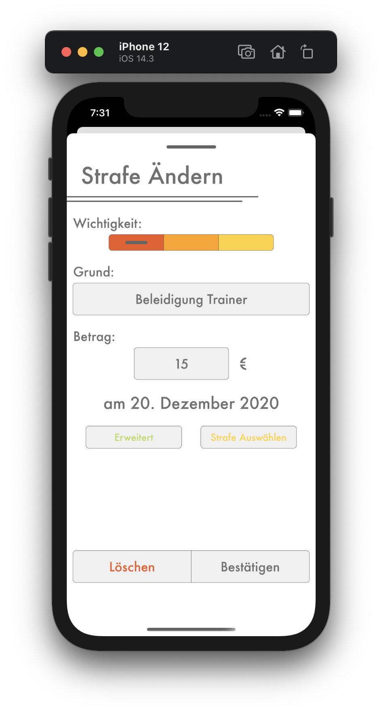
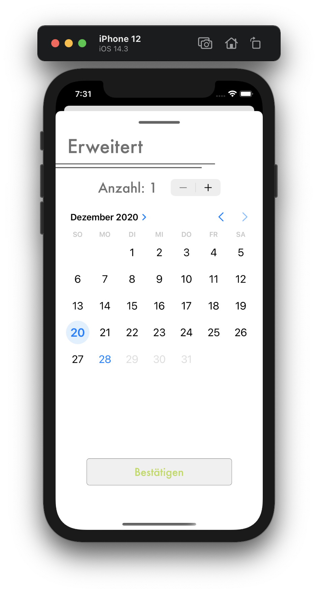

# Strafe Ändern

## <b style="color: #CC2A36;">Nur als Kassier</b>

Du kannst eine Strafe als `Bezahlt` bzw. wieder zurück zu `Austehend` markieren, indem du die Strafe auswählst, die du ändern möchtest, dadurch erscheind eine detailierte Ansicht der Strafe (Bild 1). Unten auf der Seite ist ein Indikator, der die Wichtigkeit angibt (Farbe des linken Feldes) und ob die Strafe bezahlt oder unbezahlt ist (Grauer Balken links ≙ ausstehend, Grauer Balken rechts ≙ bezahlt). Wenn du ändern möchest, ob die Strafe bezahlt wurde, drücke auf die Seite des Indikators, die du brauchst. Nach kurzer Zeit springt dann der graue Balken auf diese Seite.

Wenn du andere Daten einer Strafe ändern möchtest, drücke den `Bearbeiten` Knopf oben rechts. Dadurch erscheint die `Strafe Ändern` Seite.

1. Du kannst alle Daten einer Strafe manuell ändern, folge dafür der Anleitung zum hinzufügen einer Vorlage, da dort die selben Eingabefelder erklärt sind. Es ist allerdings bevorzugt, eine Strafe aus den Vorlagen auszuwählen, die du zuvor schon im Strafenkatalog angelegt hast. Drücke hierfür den `Strafe Auswählen` Knopf unten auf der Seite. 
2. Mit dem `Erweitert` Knopf unten auf der Seite kannst du die Anzahl und das Datum der Strafe ändern. Wofür diese Daten gebraucht werden, sind in `Strafe Hinzufügen` unter 3. und 4. beschrieben. Bestätige deine Eingabe durch den `Bestätigen` Knopf.
   
Bestätige das Ändern der Strafe mit dem `Bestätigen` Knopf unten. Nachdem du die Aktion bestätigt hast, ist die Strafe der Person geändert.
