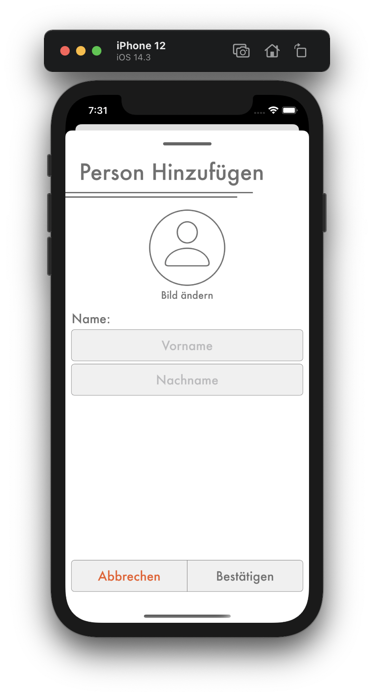

# Person Hinzufügen

## <b style="color: #CC2A36;">Nur als Kassier</b>

Du kannst eine neue Person hinzufügen, indem du bei der Personenliste den `Hinzufügen` Knopf unten rechts drückst. Dadurch erscheint die `Person Hinzufügen` Seite.

1. Die neue Person muss ein Vor- und Nachname haben, damit man sie von anderen unterscheiden kann.
2. Du kannst der Person ein Profilbild geben, damit man sie leicht erkennen kann. Die Person kann sein Bild später selbst ändern.

Bestätige das Hinzufügen der Person mit dem `Bestätigen` Knopf unten. Nachdem du die Aktion bestätigt hast, ist die Person verfügbar und du kannst ihm neue Strafen geben.
