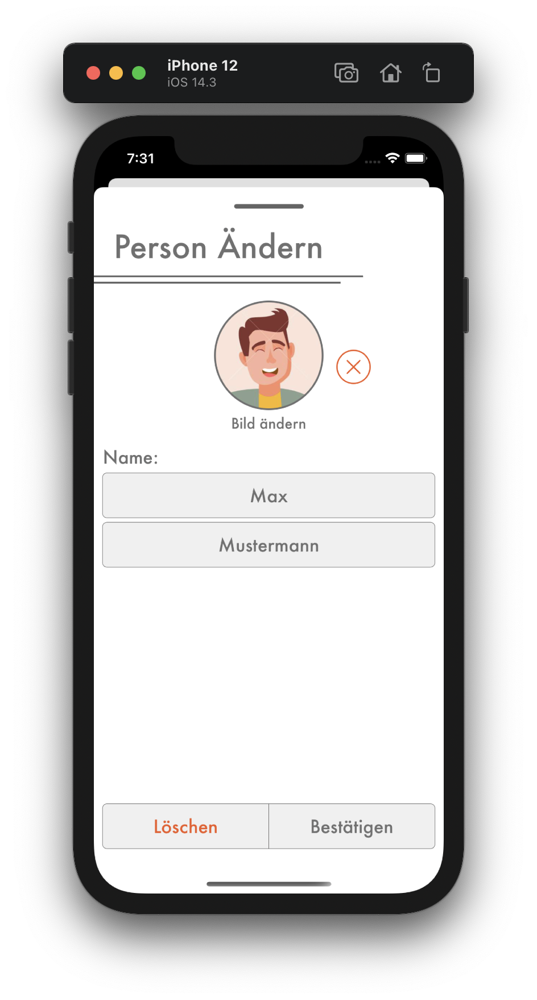

# Person Löschen

## <b style="color: #CC2A36;">Nur als Kassier</b>

Zum Löschen einer Person wähle die Person in der Personenliste aus und drück den `Bearbeiten` Knopf oben rechts. Dadurch erscheint die `Person Ändern` Seite, auf dem unten ein `Löschen` Knopf ist. Nachdem du die Aktion bestätigt hast, ist die Person aus dem Verein gelöscht. 

<b style="color: #CC2A36;">Achtung:</b> Wenn die Person sich schon registriert hat, kannst du die Person nicht mehr löschen. Es wird auch eine Fehlermeldung ausgegeben, wenn du es versuchst, sodass du es nicht aus Versehen löschen kannst. Musst du die Person trotzdem löschen, dann erzwinge das Abmelden der Person in den Einstellungen unter `Abmelden Anderer Erzwingen`. Danach kannst du die Person sicher löschen.
