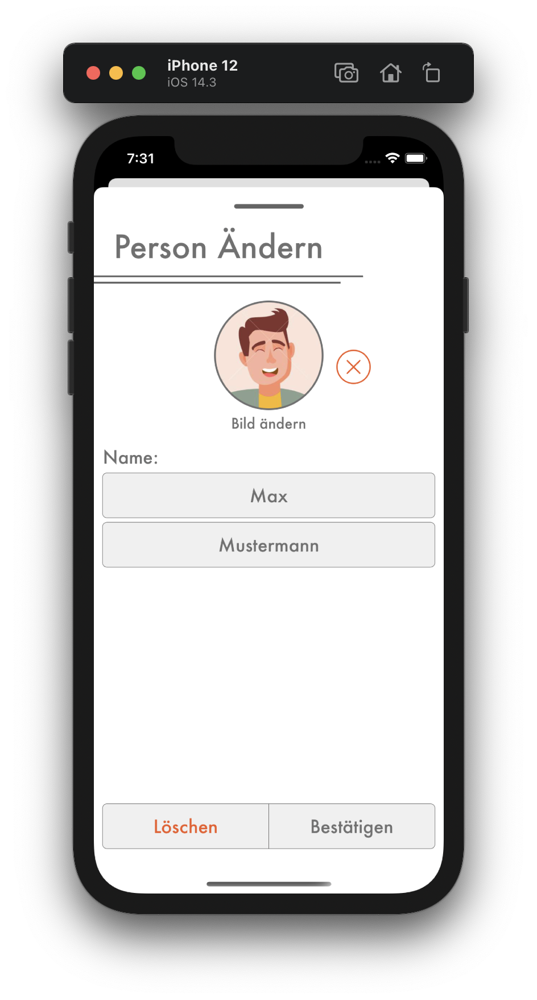

# Person Ändern

## <b style="color: #CC2A36;">Nur als Kassier</b>

Wenn du eine Person ändern willst, wähle die Person in der Personenliste aus und drück den `Bearbeiten` Knopf oben rechts. Dadurch erscheint die `Person Ändern` Seite.

1. Du kannst den Vor- und Nachnamen der Person ändern.
2. Du kannst das Profilbild ändern, die Person kann sein Bild später aber selbst ändern.

Bestätige das Ändern der Person mit dem `Bestätigen` Knopf unten. Nachdem du die Aktion bestätigt hast, ist diese Person überall geändert.
