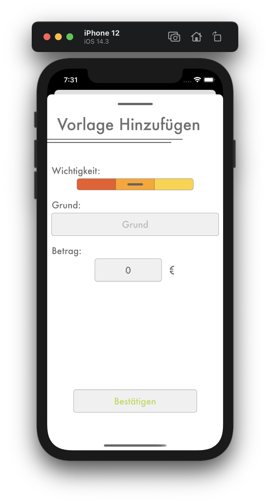

# Vorlage Hinzufügen

## <b style="color: #CC2A36;">Nur als Kassier</b>

Du kannst eine neue Vorlage hinzufügen, indem im Stafenkatalog den `Hinzufügen` Knopf unten rechts drückst. Dadurch erscheint die `Vorlage Hinzufügen` Seite.

1. Mit dem Wichtigkeitsregler kann die Wichtigkeit dieser Vorlage geändert werden. Dabei gibt es  drei Stufen:
   - Rot steht für eine wichtige Strafe, die möglichst schnell bezahlt werden soll.
   - Orange sind die mittleren Strafen.
   - Gelb sind Strafen, die nicht wichtig sind.

    Ob du die Farbcodierung als Wichtigkeit benutzt oder als etwas ganz anderes, oder welche Vorlage / Strafe wie wichtig ist, kannst du allein entscheiden. Wenn du die Farbcodierung gar nicht nutzen möchtest, stelle auf jeder Vorlage / Strafe die gleiche Wichtigkeit, z.B. sehr wichtig (rot) ein.
2. Als nächstes musst du den Grund dieser Vorlage hinzufügen, damit man später noch weiß, für was eine Strafe vergeben wurde.
3. Zum Schluss muss noch ein positiver Betrag angegben werdne. Dieser gibt an, wie viel ein Spieler, der eine Strafe mit dieser Vorlage bekommen hat, bezahlen muss.

Bestätige das Hinzufügen der Vorlage mit dem `Bestätigen` Knopf unten. Nachdem du die Aktion bestätigt hast, ist die Vorlage zum Strafenkatalog hinzugefügt und du kannst sie bei neuen oder geänderten Strafen verwenden.
