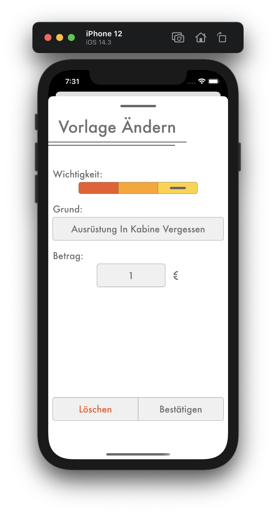

# Vorlage Löschen

## <b style="color: #CC2A36;">Nur als Kassier</b>

Zum Löschen einer Vorlage gehe zum Strafenkatalog und wähle die Vorlage aus, die die löschen möchtest. Dadurch erscheint die `Vorlage Ändern` Seite, auf dem unten ein `Löschen` Knopf ist. Nachdem du die Aktion bestätigt hast, ist die Vorlage gelöscht und kann nicht mehr verwendet werden. 

<b style="color: #CC2A36;">Achtung:</b> Da Strafen eine Referenz auf eine Vorlage haben können, kann keine Vorlage gelöscht werden, die in irgendeiner Strafe verwendet wird. Es wird auch eine Fehlermeldung ausgegeben, wenn du es versuchst, sodass du es nicht aus Versehen löschen kannst. Ändere erst alle Strafen, die die Vorlage benutzt, dann kannst du die Vorlage sicher löschen.
