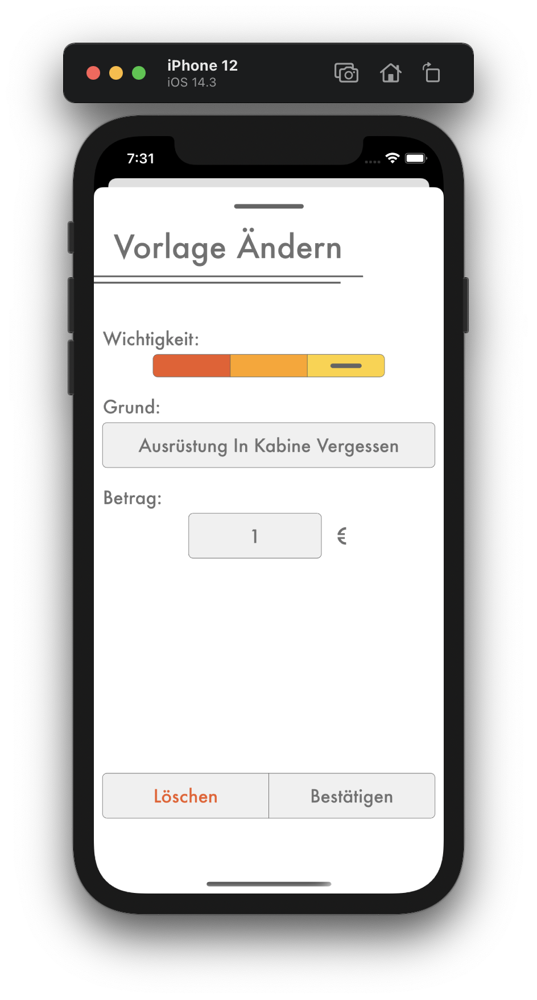

# Vorlage Ändern

## <b style="color: #CC2A36;">Nur als Kassier</b>

Wenn du eine Vorlage ändern willst, gehe zum Strafenkatalog und wähle die Vorlage aus, die die ändern willst. Dadurch erscheint die `Vorlage Ändern` Seite. Durch das Ändern eine Vorlage werden alle Strafen, die diese Vorlage vewenden, auf die neue Vorlage aktualisiert.

1. Mit dem Wichtigkeitsregler kann die Wichtigkeit dieser Vorlage geändert werden. Dabei gibt es  drei Stufen:
   - Rot steht für eine wichtige Strafe, die möglichst schnell bezahlt werden soll.
   - Orange sind die mittleren Strafen.
   - Gelb sind Strafen, die nicht wichtig sind.

    Ob du die Farbcodierung als Wichtigkeit benutzt oder als etwas ganz anderes, oder welche Vorlage / Strafe wie wichtig ist, kannst du allein entscheiden. Wenn du die Farbcodierung gar nicht nutzen möchtest, stelle auf jeder Vorlage / Strafe die gleiche Wichtigkeit, z.B. sehr wichtig (rot) ein.
2. Als nächstes kannst du den Grund dieser Vorlage ändern, damit man später noch weiß, für was eine Strafe vergeben wurde.
3. Zum Schluss kann noch der Betrag geändert werden. Dieser gibt an, wie viel ein Spieler, der eine Strafe mit dieser Vorlage bekommen hat, bezahlen muss.

Bestätige das Ändern der Vorlage mit dem `Bestätigen` Knopf unten. Nachdem du die Aktion bestätigt hast, ist die Vorlage und alle Strafen, die diese Vorlage nutzt, geändert. 
