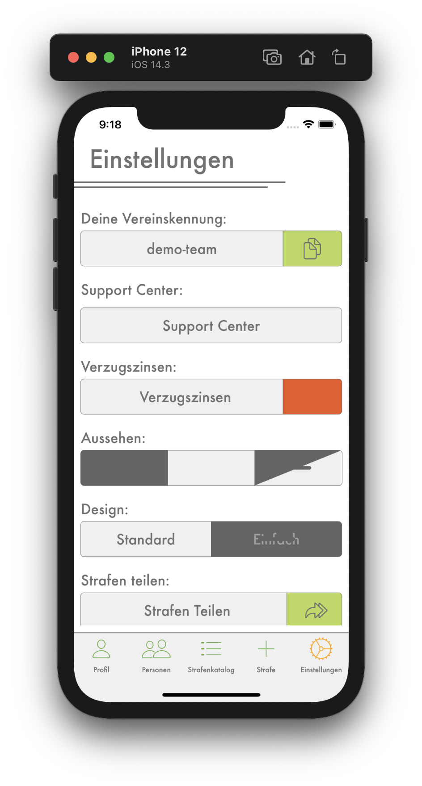
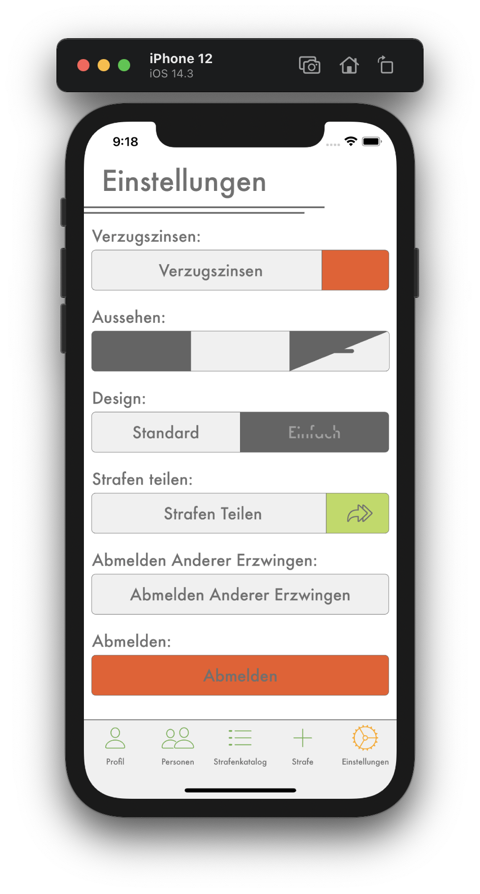

# Allgemeine Einstellungen

## Deine Vereinskennung
Du kannst die Kennung deines Vereins anderen Spieler deines Teams geben, damit sie auch eurem Verein beitreten können.

---
 

## Support Center
Im Support Center findest du Hilfe zu vielen relevaten Themen der App. Sollte noch etwas darin fehlen, schreibe uns dies in den [Feedbacks](https://github.com/stevenkellner/strafen/issues).

---
 

## Verzugszinsen
<b style="color: #CC2A36;">Nur als Kassier</b> - Hier kannst du die Verzugszinsen einstellen, wie genau das funktioniert, steht im `Verzugzinsen` Tab des Support Centers.

---
 

## Aussehen
Es gibt drei Möglichkeiten das Aussehen der App anzupassen:
1. Dauerhaft dunkles Aussehen
2. Dauerhaft helles Aussehen
3. Aussehen ändert sich wie die Systemeinstellungen deines Gerätes

---
 

## Design
Es gibt zwei Möglichkeiten das Design der App anzupassen:
1. Standard: Farbenfrohes, abgerundetes Design
2. Einfach: Schmuckloses Design

---
 

## Strafen Teilen
<b style="color: #CC2A36;">Nur als Kassier</b> - Hier kannst du die Strafen aller Personen kopieren oder auf verschieden sozialen Portalen teile. Wie genau das funktioniert, steht im `Strafen Teilen` Tab des Support Centers.

---
 

## Abmelden Anderer Erzwingen
<b style="color: #CC2A36;">Nur als Kassier</b> - Hier kannst du andere Mitglieder abmelden, wenn sie sich z.B. mit der falschen Person angemeldet haben. Wie genau das funktioniert, steht im `Abmelden Anderer Erzwingen` Tab des Support Centers.

---
 

## Abmelden
Melde dich von der App ab und gelange wieder zurück zur Anmelde- und Registrierungsseite.

---
