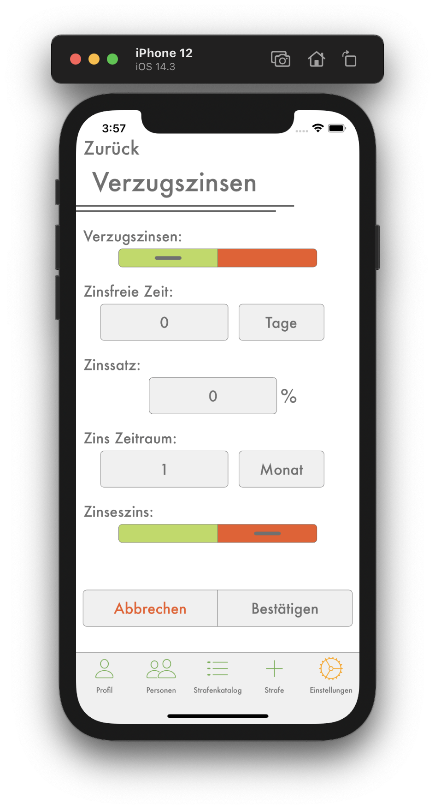

# Verzugzinsen

## <b style="color: #CC2A36;">Nur als Kassier</b>

## Verzugszinsenregler
Mit dem obersten Regler kannst du einstellen, ob überhaupt bei allen unbezahlten Strafen nach einer angegebenen Zeit Verzugszinsen anfallen.

---
 

## Zinsfreie Zeit
Das ist der Zeitraum, in der deine Mitspieler Zeit haben die Strafe zu zahlen, ohne dass irgendwelche Zinsen anfallen. Du kannst einen beliebigen Zeitraum und entweder Tage, Monate oder Jahre als Einheit auswählen.

---
 

## Zinssatz
Der Zinssatz gibt an, wie viel Prozent der Strafe nach jedem Zinszeitraum als Verzugszinsen hinzugefügt werden sollen.

---
 

## Zins Zeitraum
Nach diesem Zeitraum werden immer wieder neue Verzugszinsen anfallen. Du kannst einen beliebigen Zeitraum und entweder Tage, Monate oder Jahre als Einheit auswählen. Die Zinsen werden immer am Ende des Zeitraums hinzugefügt, d.h. beispielsweise, wenn du eine Zinsfreie Zeit und einen Zinszeitraum von jeweils einem Monat angibst, fallen die ersten Zinsen erst nach zwei Monaten an und dann jeden Monat wieder.

---
 

## Zinseszins
Hier kannst du angeben, ob die Verzugszinsen mit Zinseszins gerechnet werden sollen. Ist der Zinseszins aktiviert, wird nach jedem Zinszeitraum auch die vorherig angefallenen Zinsen verzinst. Ansonsten wwird nur der Betrag der eigentlichen Strafe nach jedem Zinszeitraum verzinst, d.h. der Zinsbetrag, der jede Periode hinzukommt, bleibt konstant.
