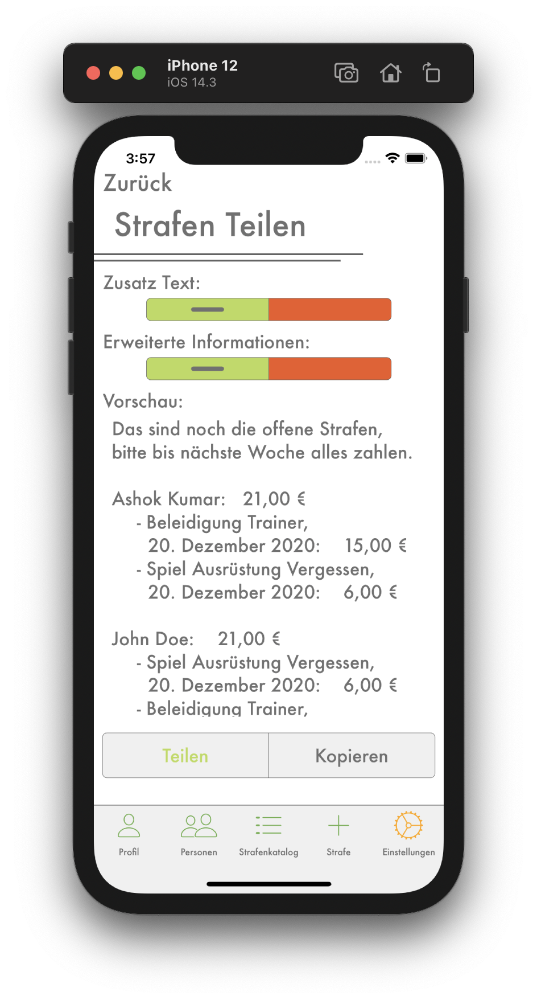
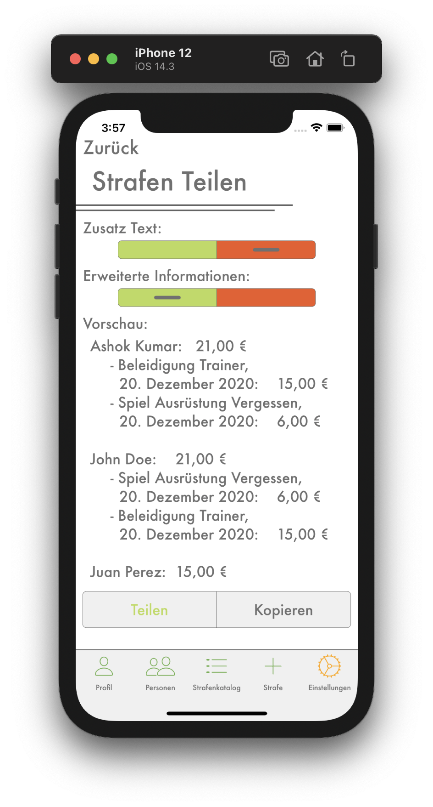
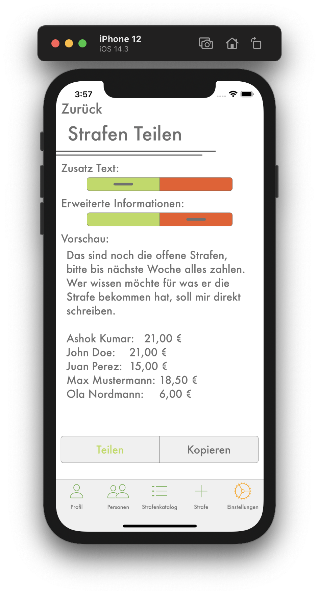

# Strafen Teilen

## <b style="color: #CC2A36;">Nur als Kassier</b>

Hier kannst du alle offenen Strafen mit deinem Team teilen, damit du sie auch über soziale Medien, wie WhatsApp, erinneren kannst, noch die offenen Strafen zu zahlen. Mit den Tasten `Teilen` und `Kopieren` am unteren Rand kannst du den Text der im Vorschau angezeigt wird entweder in die Zwischenablage kopieren oder auf beliebigen sozialen Medien teilen.

---
 

## Zusatztext
Du kannst angeben ob über den offenen Strafen noch eine zusätzlicher Text angezeigt werden soll (siehe Bild 1 und 3).

---
 

## Erweiterte Informationen
Wenn diese Funktion aktiviert ist, wird unter dem offenen Betrag des einzelnen Spielers noch angezeigt, für was und wann er diese Strafe erhalten hat (siehe Bild 1 und 2).

---
